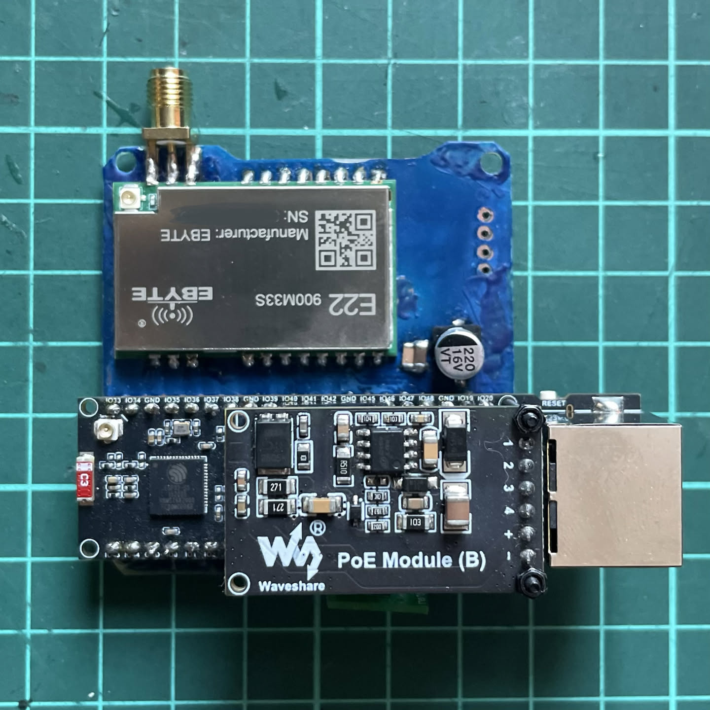

 

# PoEBytastic

e22-900m30s/e22-900m33s + ESP32-S3-ETH-PoE based meshtastic node with PoE power supply

* WARNING! The project is in the testing phase.

# Description of the PCB

* PCB based on Ebytastic, has aux i/o, 5v, 3.3v outputs, SMA F antenna connector, optional pullups for i2c sensors, pins for bme280 and mosfets for optional perepherial devices (do not use it if ospi on).

# BOM
* [Waveshare ESP32-S3-ETH-PoE](https://aliexpress.ru/item/1005008001642764.html)
* [Ebyte E22 900m30s](https://aliexpress.ru/item/4000543921245.html)
* [Ebyte E22 900m33s](https://aliexpress.ru/item/1005006786465395.html)
* [Electrolityc cap 100uF 16v](https://sl.aliexpress.ru/p?key=IorTVxA) [or better 220uF 16v](https://sl.aliexpress.ru/p?key=uvrTVZz)
* [Ceramic caps: 0.1uF,](https://sl.aliexpress.ru/p?key=m0rTVX8) [4.7uF](https://sl.aliexpress.ru/p?key=70rTVFE)
* [SMA F Edge](https://sl.aliexpress.ru/p?key=TurTVN7)

* Optionally:
  * [Mosfets](https://sl.aliexpress.ru/p?key=k9rTV0U)
  * [Resistors 10 kOhm](https://sl.aliexpress.ru/p?key=ukrTVfk)

# [You can say thanx to me here](https://pay.cloudtips.ru/p/c197b86d)
